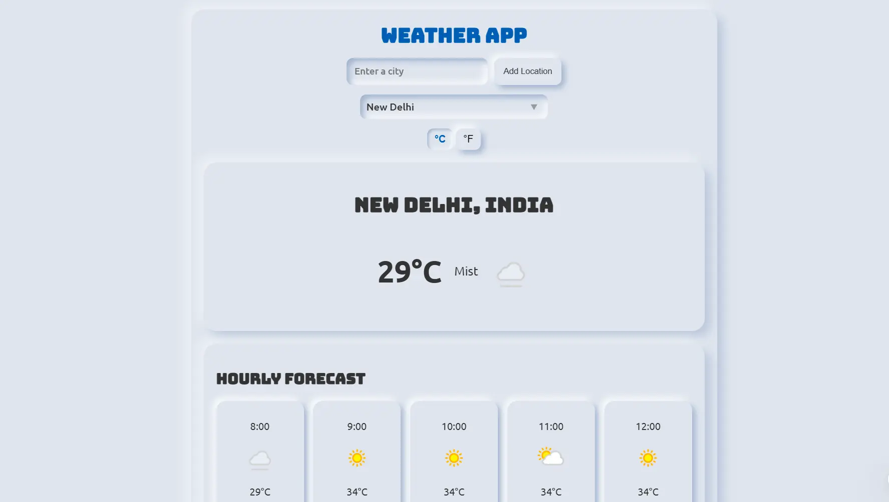
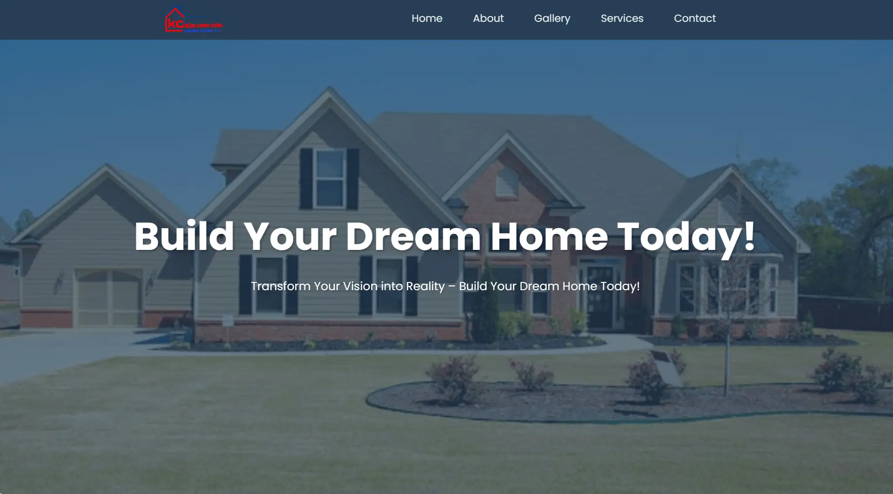
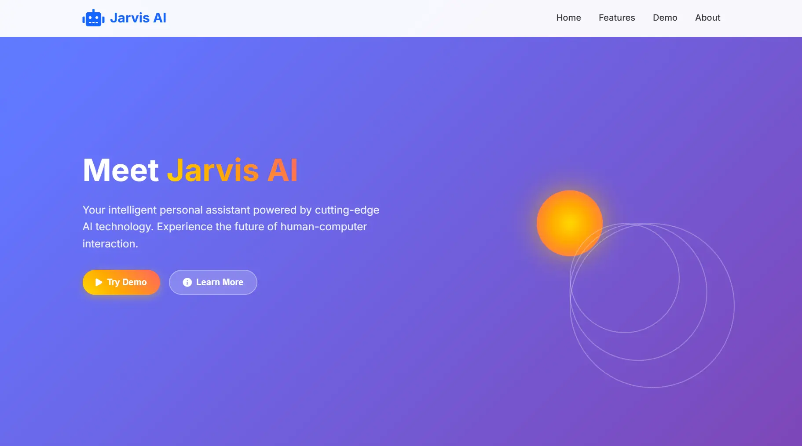
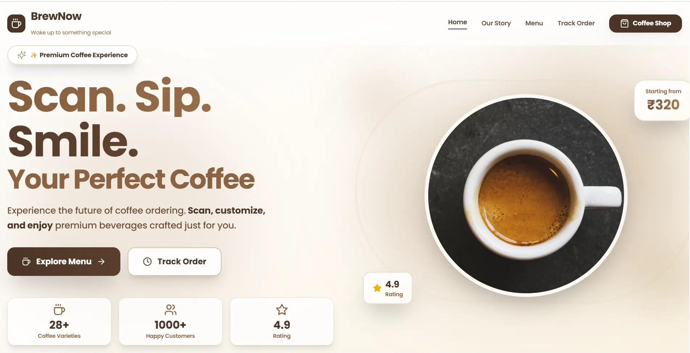

# Vicky Narvare - Portfolio Website

A modern, responsive portfolio website built with React and Vite. Showcasing frontend development skills, projects, and services.


## 🚀 Live Demo

[https://vickynarvare.vercel.app](https://vickynarvare.vercel.app)

## ✨ Features

- **Responsive Design** - Works seamlessly on all devices
- **Dark/Light Theme** - Toggle between themes with localStorage persistence
- **Smooth Animations** - CSS animations and transitions
- **Loading Screen** - Animated loading screen on initial load
- **Tech Marquee** - Auto-scrolling technology showcase
- **Typing Effect** - Dynamic typing animation in hero section
- **Toast Notifications** - React Toastify for user feedback
- **Contact Form** - Form with validation
- **Floating Social Links** - Quick access to social profiles

## 🛠️ Tech Stack

- **React 19** - UI Library
- **Vite** - Build Tool
- **React Icons** - Icon Library
- **React Toastify** - Toast Notifications
- **CSS3** - Styling with CSS Variables
- **GSAP** - Animation Library (optional)

## 📁 Project Structure

```
src/
├── components/
│   ├── About.jsx
│   ├── Contact.jsx
│   ├── FloatingSocial.jsx
│   ├── Footer.jsx
│   ├── Hero.jsx
│   ├── LoadingScreen.jsx
│   ├── Navbar.jsx
│   ├── Projects.jsx
│   ├── Services.jsx
│   └── Skills.jsx
├── context/
│   └── ThemeContext.jsx
├── data/
│   └── index.js
├── hooks/
│   └── useTypingEffect.js
├── App.jsx
├── App.css
├── index.css
└── main.jsx
```

## 🚀 Getting Started

### Prerequisites

- Node.js 18+ 
- npm or yarn

### Installation

1. Clone the repository
```bash
git clone https://github.com/VickyNarvare/portfolio.git
cd portfolio
```

2. Install dependencies
```bash
npm install
```

3. Start development server
```bash
npm run dev
```

4. Open [http://localhost:5173](http://localhost:5173) in your browser

### Build for Production

```bash
npm run build
```

### Preview Production Build

```bash
npm run preview
```

## 📝 Customization

### Update Personal Info

Edit `src/data/index.js` to update:
- Projects data
- Skills data
- Services data
- Social links
- Technologies for marquee

### Update Styles

Edit `src/App.css` to customize:
- Colors (CSS variables in `:root`)
- Fonts
- Spacing
- Animations

## 📱 Sections

1. **Home** - Hero section with typing effect and tech marquee
2. **About** - Personal introduction and image
3. **Skills** - Technical skills categorized
4. **Services** - Services offered with expandable cards
5. **Projects** - Portfolio projects with links
6. **Contact** - Contact form and social links

## 🖼️ Projects Preview

<p>
  
  
  
  
  
</p>

## 🎨 Color Scheme

| Variable | Light Mode | Dark Mode |
|----------|------------|-----------|
| `--accent` | #4070f4 | #6ea8ff |
| `--accent-2` | #3056d3 | #4a6ef7 |
| `--body-color` | #e4e9f7 | #2c2c2d |
| `--text-color` | #111 | #fff |

## 📄 License

This project is open source and available under the [MIT License](LICENSE).

## 👤 Author

**Vicky Narvare**

- Website: [vickynarvare.vercel.app](https://vickynarvare.vercel.app)
- GitHub: [@VickyNarvare](https://github.com/VickyNarvare)
- LinkedIn: [Vicky Narvare](https://www.linkedin.com/in/vicky-narvare-4a7712395)

---

⭐ Star this repo if you like it!
